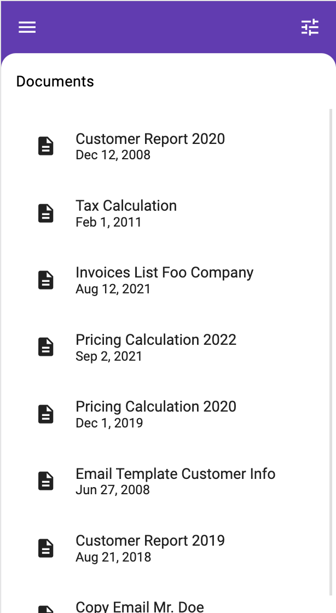

# NgxMatBackdrop

Implementation of Material Design [Backdrop](https://material.io/components/backdrop) for Angular.  



### Installation

`npm install ngx-mat-backdrop --save`

### Usage

Import `MatBackdropModule` into your application:

```typescript
@NgModule({
  declarations: [
    AppComponent
  ],
  imports: [
    MatBackdropModule
  ],
  providers: [],
  bootstrap: [AppComponent]
})
export class AppModule { }
```

`MatBackdrop` works seamlessly with Angular Material. You can combine it with all Angular Material components.

### Theming

`MatBackdrop` supports Angular Material's component theming. You can apply one of the predefines Material-Themes or a custom theme to `MatBackdrop`. Also `MatBackdrop` supports Angular Material's typography system:

```scss
@use '@angular/material' as mat;
@use 'ngx-mat-backdrop/theming' as backdrop;

$primary-palette: mat.define-palette(mat.$deep-purple-palette, 500);
$accent-palette: mat.define-palette(mat.$amber-palette, A200, A100, A400);

$light-theme: mat.define-light-theme((
 color: (
   primary: $primary-palette,
   accent: $accent-palette
 ),
 typography: mat.define-typography-config(
    $font-family: 'Roboto',
  )
));

// Include theme styles for Angular Material components.
@include mat.all-component-themes($light-theme);

// Include theme styles for ngx-mat-backdrop components.
@include backdrop.backdrop-theme($light-theme);
```

### Basic Backdrop section

The most basic `Backdrop` needs only three elements: The `Backdrop-Container`, a `Backlayer` and a `Frontlayer`:

```html
<mat-backdrop [matBackdropTriggerFor]="frontlayer">
  <mat-backlayer>
    ... <-- Place your backlayer content here
  </mat-backlayer>

  <mat-frontlayer #frontlayer>
    ... <-- Place your frontlayer content here
  </mat-frontlayer>
</mat-backdrop>
```

`MatBackdrop` provides a number of preset sections that you can use inside of `<mat-backlayer>`- or `<mat-frontlayer>`-section:

| Element | Description |
| ------- | ----------- |
| `<mat-backlayer-title>` | Sticky toolbar on top of the `Backlayer` |
| `<mat-backlayer-content>` | `Backlayer` content section, hidden by the `Frontlayer`. This section gets revealed due to a user action |
| `<mat-frontlayer-title>` | Sticky `Frontlayer` title |
| `<mat-frontlayer-content>` | Scrollable content of the `Frontlayer` |

### Backlayer title

`<mat-backlayer-title>` gives the ability to add a rich header to the `Backlayer`. `MatBackdrop` provides preset elements, a header can contain:

#### Backlayer close

The `mat-backlayer-close`-Directive enriches a user defined button with the ability to conceal the `<mat-backlayer-content>`-section:

```html
<mat-backlayer-title>
  <button mat-backlayer-close (click)="onOpenMenu()">
    <mat-icon>menu</mat-icon>
  </button>
</mat-backlayer-title>
<mat-backlayer-content>
  ...
</mat-backlayer-content>
```

#### Backlayer toggle

The `mat-backlayer-toggle`-Directive enriches a user defined button with the ability to dynamically reveal or conceal the `<mat-backlayer-content>`-section, depending on its current state:

```html
<mat-backlayer-title>
  <button mat-backlayer-toggle [offset]="'250px'">
    <mat-icon>menu</mat-icon>
  </button>
</mat-backlayer-title>
<mat-backlayer-content>
  ...
</mat-backlayer-content>
```

The `[offset]`-Parameter defines the new position of the `Frontlayer` after button click. If you give this parameter the value `'full'` the `Backlayer` gets fully revealed, means the `Frontlayer` moves to the bottom of the viewport.

#### Backlayer move

The `<mat-backlayer-move>` -Directive enriches a user defined button with the ability to change the position of the `Frontlayer` after `<mat-backlayer-content>`-section has been concealed.  

__Recommendation:__ Use `<mat-backlayer-move>`-Directive and set the `[offset]`-Parameter to `'full'` to reveal a second `Backlayer`-section, e.g. for showing some user settings.

#### Backlayer events

A `Backlayer` button directive notifies you when it has finished concealing or revealing the `<mat-backlayer-content>`-section using one of the following events: `(open)`, `(close)` or `(move)`:

```html
<mat-backlayer-title>
  <button mat-backlayer-toggle [offset]="'full'" (open)="onOpenSettings()" (close)="onCloseSettings()">
    <mat-icon>tune</mat-icon>
  </button>
</mat-backlayer-title>
```